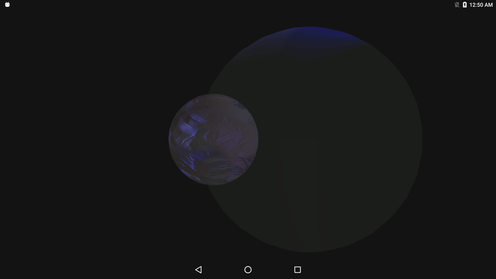

Deferred Rendering using Multipass 
==================================
This Vulkan example shows how implement deferred rendering, using Vulkan multipass. 

Pre-requisites
--------------
- Tested with Android Studio 2.2.3 with NDK bundle r13b
- Qualcomm® Adreno™ SDK for Vulkan™

Getting Started
---------------
1. Launch Android Studio.
2. Open the sample directory.
3. Rebuild the project, which will allow the sample to pick up SDK/NDK locations locally.
4. Click Run/Run 'app'.

Shaders are pre-compiled with glslang to SPIR-V binaries, and included in the Asset folder of the project for loading. Sources available in the shaders/ subfolder.

Debugging
---------
To debug, use the 'app-native' configuration, selecting Debug rather than Run. It is normal for deployment and
application initialization to take significantly more time.

Screenshots
-----------

