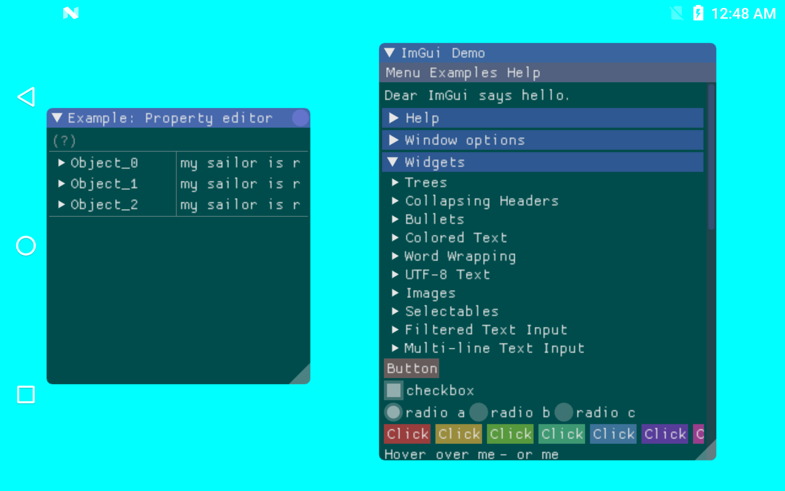

Gui
===============
This Vulkan example shows how to create an immediate mode gui (graphics user interface).  We’ve ported the ImGui library to Vulkan and allowed it to be used in this SDK.  ImGui is a popular C++ user interface library with a rich set of widgets that are rendered immediately in your application.  The sample renders the ImGui TestWindow which shows off many of the possible interface options.   Refer to https://github.com/ocornut/imgui for additional information and ImGui and the Developer Guide document for ImGui’s license and permission notice.

Prerequisites
-------------
- Tested with Android Studio 2.2.3 with NDK bundle r13b
- Qualcomm® Adreno™ SDK for Vulkan™

Getting Started
---------------
1. Launch Android Studio.
2. Open the sample directory.
3. Rebuild the project, which will allow the sample to pick up SDK/NDK locations locally.
4. Click Run/Run 'app'.

Shaders are within app/src/main/jni/shaders. They are automatically built in the Android Studio project, as long as glslangValidator is on the path. More information on shader compilation be found in the "Compiling Shaders to SPIR-V" document.

Debugging
---------
To debug, use the 'app-native' configuration, selecting Debug rather than Run. It is normal for deployment and
application initialization to take significantly more time.

Screenshots
-----------

