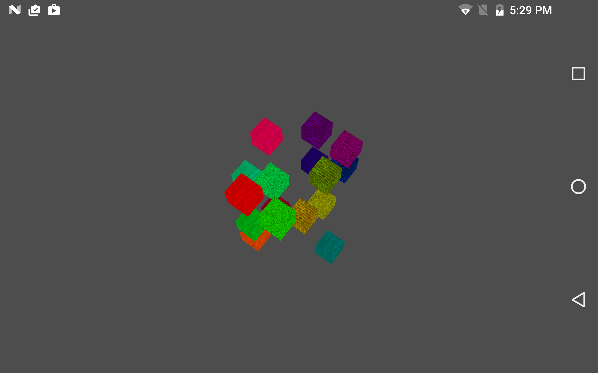

Multithreading
===============
This Vulkan example shows how to use multiple threads to update separate secondary command buffers in parallel. Each thread creates and updates it's own descriptor set, pipeline, vertex buffer, and command buffer. The final rendering shows a colored and textured cube rendered by each thread, called by a primary command buffer.

Prerequisites
--------------
- Tested with Android Studio 2.2.3 with NDK bundle r13b
- Qualcomm® Adreno™ SDK for Vulkan™

Getting Started
---------------
1. Launch Android Studio.
2. Open the sample directory.
3. Rebuild the project, which will allow the sample to pick up SDK/NDK locations locally.
4. Click Run/Run 'app'.

Shaders are within app/src/main/jni/shaders. They are automatically built in the Android Studio project, as long as glslangValidator is on the path. More information on shader compilation be found in the "Compiling Shaders to SPIR-V" document.

Debugging
---------
To debug, use the 'app-native' configuration, selecting Debug rather than Run. It is normal for deployment and
application initialization to take significantly more time.

Screenshots
-----------

