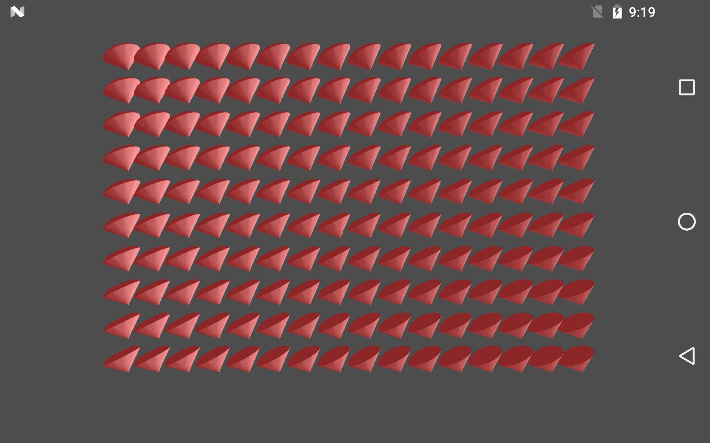

Suballocation
===============
This Vulkan example shows how to suballocate memory to minimize the total number of memory allocations made by a Vulkan application.  Efficient memory allocation in Vulkan can be accomplished by using a suballocation technique.  You can minimize the cost and overheads of using the vkAllocMemory API by allocating just a few large allocations and then suballocating memory requests from them.  The MemoryAllocator class in the framework implements a simple suballocation scheme. This example renders a set of red diamonds whose memory is suballocated from a single large allocation. 

Pre-requisites
--------------
- Tested with Android Studio 2.2.3 with NDK bundle r13b
- Qualcomm® Adreno™ SDK for Vulkan™

Getting Started
---------------
1. Launch Android Studio.
2. Open the sample directory.
3. Rebuild the project, which will allow the sample to pick up SDK/NDK locations locally.
4. Click Run/Run 'app'.

Shaders are within app/src/main/jni/shaders. They are automatically built in the Android Studio project, as long as glslangValidator is on the path. More information on shader compilation be found in the "Compiling Shaders to SPIR-V" document.

Debugging
---------
To debug, use the 'app-native' configuration, selecting Debug rather than Run. It is normal for deployment and
application initialization to take significantly more time.

Screenshots
-----------

