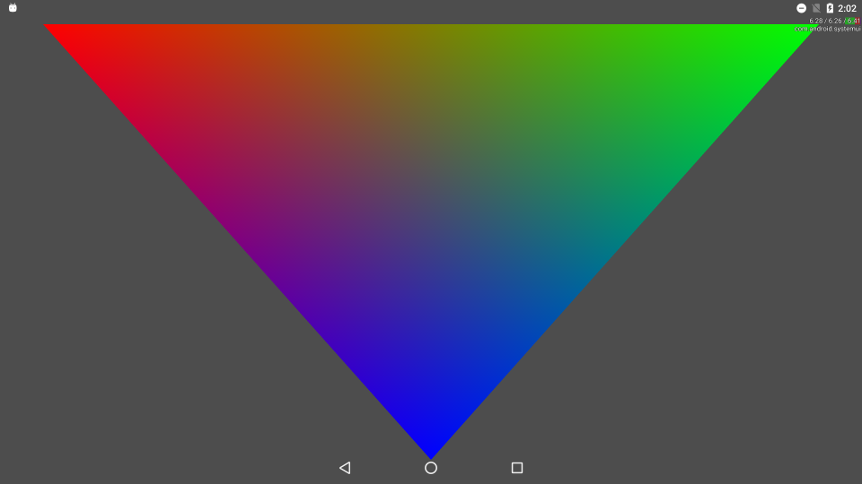

Triangle
===============
This Vulkan example shows how to set up basic device state, and draw a triangle with vertex colours.

Prerequisites
--------------
- Tested with Android Studio 2.2.3 with NDK bundle r13b
- Qualcomm® Adreno™ SDK for Vulkan™

Getting Started
---------------
1. Launch Android Studio.
2. Open the sample directory.
3. Rebuild the project, which will allow the sample to pick up SDK/NDK locations locally.
4. Click Run/Run 'app'.

The shaders for this sample are in the shaders/ subdirectory. They are compiled to SPIR-V with glslang, and embedded directly in the source code within shaders.h.

Debugging
---------
To debug, use the 'app-native' configuration, selecting Debug rather than Run. It is normal for deployment and
application initialization to take significantly more time.

Screenshots
-----------

