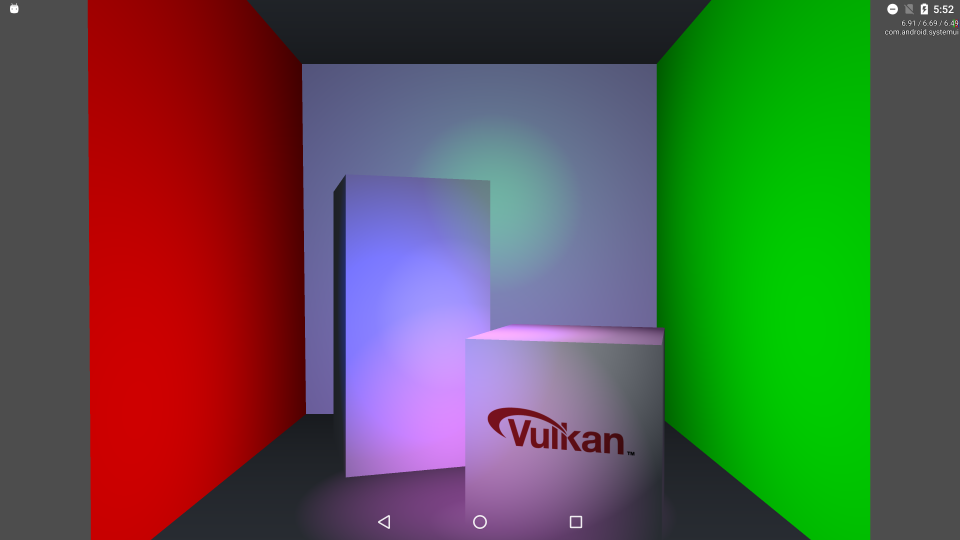

Tutorial: Cornell Lights
===============
This Vulkan example shows a cornell box scene with simple point lighting. It is accompanied with a walk-though tutorial on its implementation. In this tutorial, the lights are implemented using a fragment shader that iteratively adds brightness and diffuse coloring depending on light positions and colors in world space. The fragment shader has a uniform containing a number of point light locations and colors. There is also a texture sampler, and this texture is mapped to a side of the small box using correct texture coordinates in the mesh object. 

Pre-requisites
--------------
- Tested with Android Studio 2.2.3 with NDK bundle r13b
- Qualcomm® Adreno™ SDK for Vulkan™

Getting Started
---------------
1. Launch Android Studio.
2. Open the sample directory.
3. Rebuild the project, which will allow the sample to pick up SDK/NDK locations locally.
4. Click Run/Run 'app'.

Shaders are within app/src/main/jni/shaders. They are automatically built in the Android Studio project, as long as glslangValidator is on the path. More information on shader compilation be found in the "Compiling Shaders to SPIR-V" document.

Debugging
---------
To debug, use the 'app-native' configuration, selecting Debug rather than Run. It is normal for deployment and
application initialization to take significantly more time.

Screenshots
-----------

