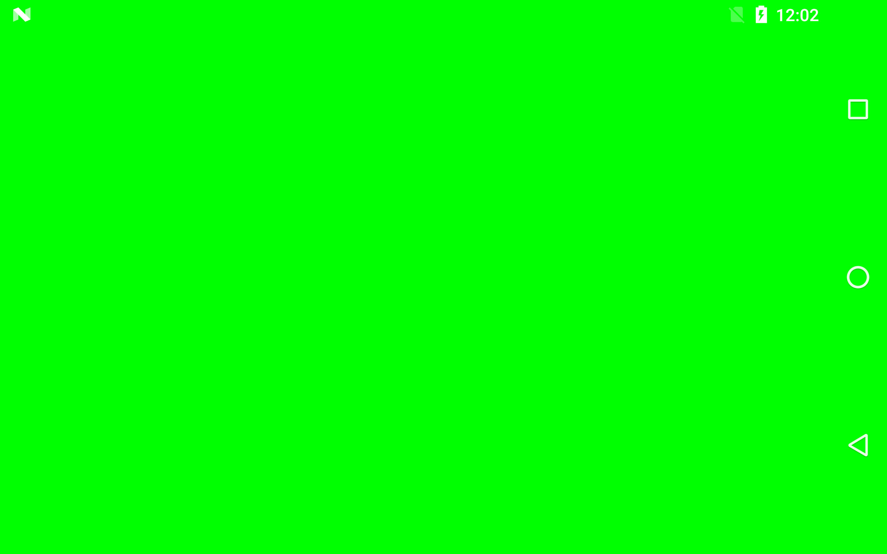

Validation
===============
This Vulkan example shows how to use the validation layers to check correct Vulkan usage.  Validation is a useful feature provided by various Vulkan layers.  Enabling validation in our framework will provide you with numerous warnings and errors that will help detect errors and allow you to write cleaner Vulkan code.  In our framework, you can enable validation by calling SetUseValidation(true) in the sample constructor.   The framework takes care of detecting and loading the appropriate external layers which implement the validation.  Warnings and errors are caught in the DebugReportCallback function in the framework and are logged.  This example renders a sold green frame by simply setting the clear color to green. 

Pre-requisites
--------------
- Tested with Android Studio 2.2.3 with NDK bundle r13b
- Qualcomm® Adreno™ SDK for Vulkan™

Getting Started
---------------
1. Launch Android Studio.
2. Open the sample directory.
3. Rebuild the project, which will allow the sample to pick up SDK/NDK locations locally.
4. Click Run/Run 'app'.

There are no shaders or assets used in this sample.  The samples simples renders a solid green screen.

Debugging
---------
To debug, use the 'app-native' configuration, selecting Debug rather than Run. It is normal for deployment and
application initialization to take significantly more time.

Screenshots
-----------

